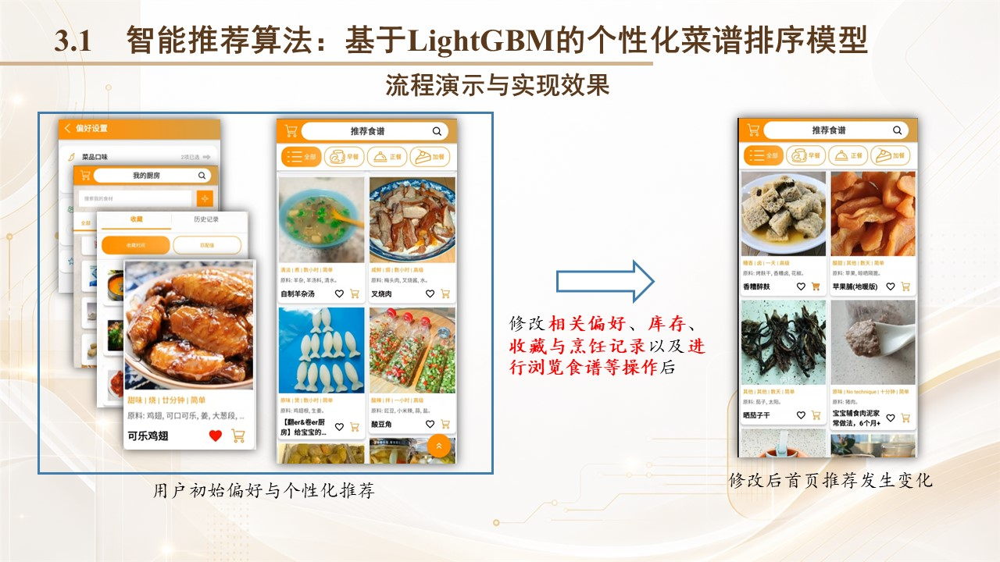
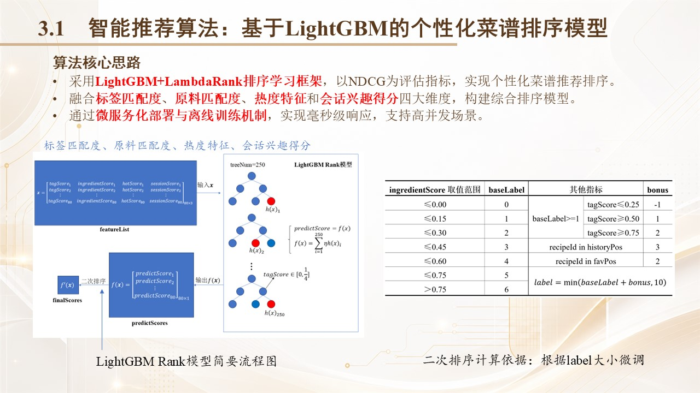
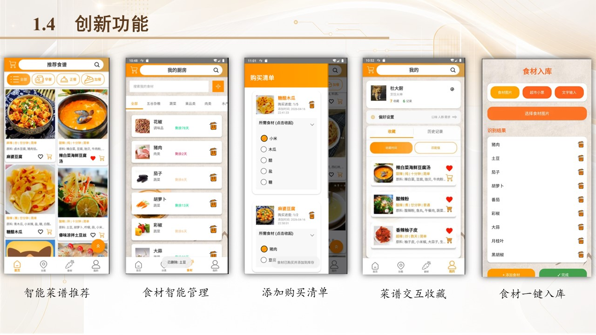

# 厨房管家：智能食材管理与个性化推荐系统

厨房管家面向日常烹饪场景，提供菜谱推荐、食材库存管理、购物清单与收藏等功能。本仓库包含 Spring Boot 后端、Python 推荐模型及 Docker 部署配置。

## 效果展示

### 个性化推荐效果

图 1：用户调整偏好、库存及相关行为记录后，推荐列表随之更新。

### 推荐算法原理

图 2：结合标签匹配度、食材匹配度、菜谱热度与会话兴趣，使用 LightGBM LambdaRank 进行菜谱排序。

### 应用功能界面

图 3：菜谱推荐、食材管理、购物清单、菜谱收藏与食材入库等功能的界面展示。

## 技术与目录

- `src/`：Spring Boot 后端，使用 Spring Data JPA 访问 MySQL，并集成 Elasticsearch。
- `python/`：GRU4Rec 会话兴趣建模、LightGBM 排序训练及 Flask 推理服务。
- `docker/`：后端、模型服务、MySQL 与 Elasticsearch 的 Docker Compose 部署配置。
- `imgs/`：项目效果与算法原理示意图。

Android 客户端：[kitchen-manager-Android](https://gitee.com/starriee/kitchen-manager-Android)。
